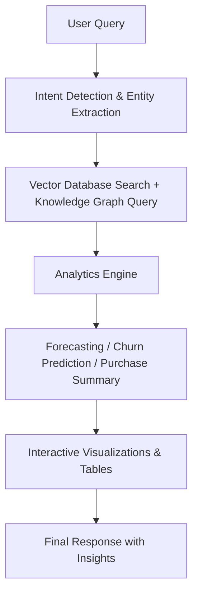

# RAG based semantic retail search assistant

An interactive retail analytics assistant that combines **retrieval-augmented generation (RAG)**, **knowledge graph reasoning**, and **predictive analytics** to answer business questions with context-rich explanations, visualizations, and actionable insights.  

## Key Objectives:  

- Build a system that combines descriptive analytics (purchase history, revenue summaries) and predictive analytics (sales forecasts, churn probability).  
- Make product and customer insights queryable in natural language.  
- Provide decisions with clear data tables, network graphs, and trend visualizations to support inventory planning, marketing, and retention strategies.  
- Support data versioning and reproducibility by using a vector database and structured queries that keep analysis consistent across runs.  

## Methodology:  

1. **Data Connection** – Pulls product, purchase, and customer data from Snowflake and Neo4j.  
2. **Document Processing** – Converts product details into embeddings and stores them in a Chroma vector database for semantic search.  
3. **Query Understanding** – Detects intent (forecast, churn, purchase network, general product query) using flexible text patterns.  
4. **Modeling & Analytics** –  
   - Uses Prophet for sales forecasting with daily, weekly, and yearly seasonality.  
   - Computes churn probabilities based on days since last purchase and inactivity thresholds.  
   - Generates network graphs of customer-product relationships.  
5. **Visualization** – Produces interactive charts with Plotly for trend analysis and risk categorization.  

## Model Pipeline:  

- Vector search and graph queries run in parallel to reduce latency.  
- Retrieves only top-K relevant documents to minimize computation.  
- Cleans and aggregates transactional data before modeling.  

---

## Challenges Addressed:
- Merging vector embeddings with graph relationships to avoid separated answers.  
- Uses efficient data parallelism for retrieval and processing.  
- Flexible regex-based extraction handling partial matches and misspellings.  
- Every prediction/forecast includes visual evidence and metrics.  

## Results:
- **Interactive Sales Forecasts:** Daily + 30-day predictions with confidence intervals.  
- **Customer Retention Insights:** Churn probabilities with low/medium/high risk breakdowns.  
- **Network Graphs:** Customer-product links reveal hidden clusters.  
- **Descriptive + Predictive Analytics:** Moves beyond static dashboards with dynamic Q&A.  

## Impact:
This project helps retail analysts and managers:
- Spot sales trends before they happen.  
- Identify at-risk customers early.  
- Understand customer-product relationships visually.  
- Save hours of manual SQL by using natural language.  

## Technology and Tools:
- **Backend:** Python, Streamlit  
- **Data:** Snowflake (warehouse), Neo4j (knowledge graph)  
- **AI & ML:**  
  - Sentence-Transformers (embeddings)  
  - ChromaDB (vector search)  
  - Prophet (forecasting)  
  - LangChain + Groq LLM (retrieval-augmented generation)  
