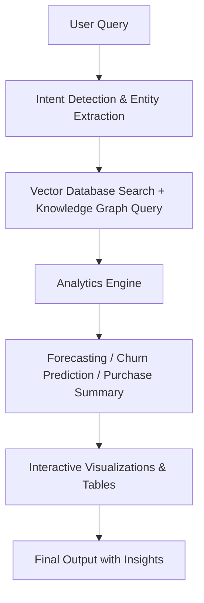

# RAG Retail Assistant  

An interactive retail analytics assistant that combines retrieval-augmented generation (RAG), knowledge graph reasoning, and predictive analytics to answer business questions with context-focused explanations, visualizations, and actionable insights.  

## Key Objectives:

- Build a system that combines descriptive analytics (purchase history, revenue summaries) and predictive analytics (sales forecasts, churn probability) into one place.  
- Make product and customer insights queryable in natural language.  
- Provide decision intelligence with clear data tables, network graphs, and trend visualizations to support inventory planning, marketing, and retention strategies.  
- Support data versioning and reproducibility by using a vector database and structured queries that keep analysis consistent across runs.
  
## Methodology:  

1. **Data Connection** – product, purchase, and customer data taken from Snowflake and Neo4j.  
2. **Data Processing** – Converting product details into embeddings using Hugging Face Sentence-Transformers (all-MiniLM-L6-v2), integrated through LangChain’s HuggingFaceEmbeddings interface and storing them in a Chroma vector database for semantic search.  
3. **Query Understanding** – Detecting intent (forecast, churn, purchase network, general product query) by using flexible text patterns.  
4. **Modeling & Analytics** –  
   - Usinh Prophet for sales forecasting with daily, weekly, and yearly seasonality.  
   - Computing churn probabilities based on days since last purchase and inactivity thresholds.  
   - Generating network graphs of customer-product relationships.  
5. **Visualization** – Producing interactive charts with Plotly for trend analysis and risk categorization.  

## Model Pipeline: 

```mermaid
flowchart TD
    A[User Query] --> B[Intent Detection & Entity Extraction]
    B --> C[Vector Database Search + Knowledge Graph Query]
    C --> D[Analytics Engine]
    D --> E[Forecasting / Churn Prediction / Purchase Summary]
    E --> F[Interactive Visualizations & Tables]
    F --> G[Final Output with Insights]
```
- Vector search and graph queries run in parallel to reduce latency.
- Retrieving only top-K relevant documents to minimize computation.
- Cleaning and aggregating transactional data before modeling.

## Challenges Addressed:

- Context Fragmentation - Merging vector embeddings with graph relationships to avoid incorrect answers.
- Efficient data parallelism for retrieval and processing for data scaling
- For Product Name Ambiguity - Included flexible regex-based extraction to handle partial matches and misspellings.
- Every prediction or forecast comes with visual evidence and supporting metrics.

## Results:

- Interactive Sales Forecasts: Average daily and total 30-day predictions with confidence intervals.
- Customer Retention Insights: Churn probabilities and risk distribution breakdowns (low, medium, high).
- Network Graphs: Visual links between customers and products that reveal hidden purchase clusters.

## Impact:

This project helps retail analysts and managers:
- Spot sales trends before they happen.
- Identify at-risk customers and act early.
- Understand customer-product relationships at a glance.
- Save hours of manual SQL work by letting them ask questions in natural language.

## Technology and Tools:
### Languages: 
- Python
- SQL

### Frameworks & Libraries:
- LangChain
- Hugging Face Sentence-Transformers (MiniLM-L6-v2)
- ChromaDB
- Prophet
- Plotly
- NetworkX
- Pandas
- NumPy
- Matplotlib
- dotenv
- Streamlit

### Data Warehouses & Infrastructure:

- Snowflake
- Neo4j
- Groq LLM API
- Chroma Vector Store
